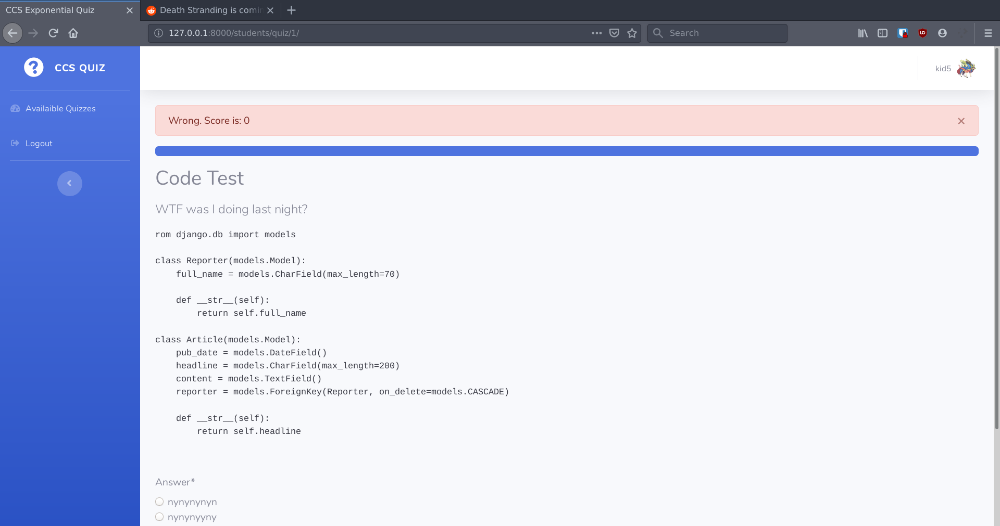
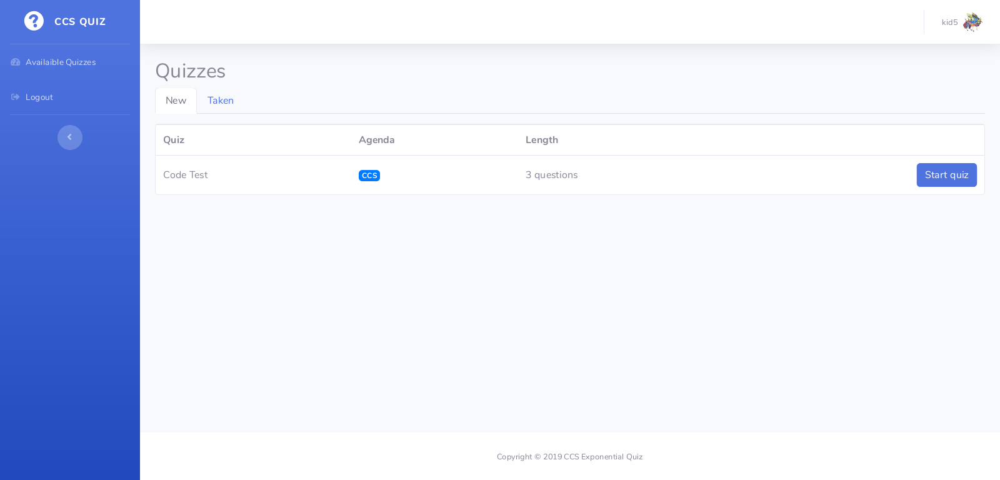
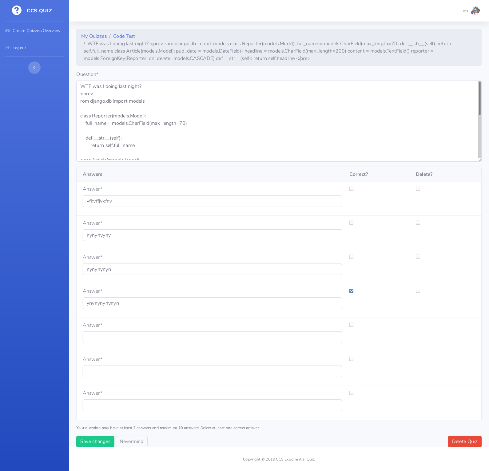

# Exponential Quiz
Online quiz app with exponential scoring. Built for a CCS-TIET event.  



Credits to [SIBTC](https://github.com/sibtc/django-multiple-user-types-example/) for the base quiz layout and mechanism.

## Running the Project Locally

First, clone the repository to your local machine:


Install the requirements:

```bash
pip install -r requirements.txt
```

Create the database:

```bash
python manage.py migrate
```

Finally, run the development server:

```bash
python manage.py runserver
```

The project will be available at **127.0.0.1:8000**.

## Screenshots





## License

The source code is released under the [MIT License](https://github.com/IceWreck/ExponentialQuizDjango/blob/master/LICENSE).
